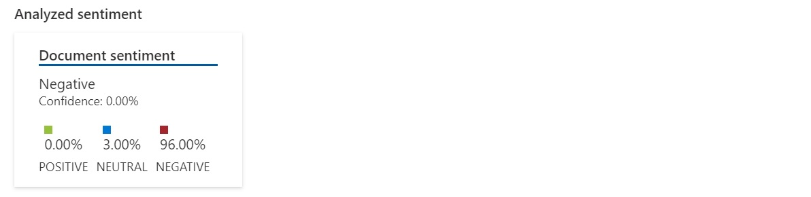
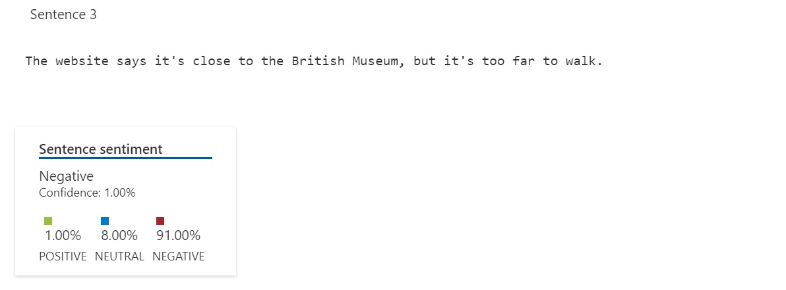

[\[English\]](#introduction) [\[Português\]](READMEP.md)
_______________________________________________________________________________________________________________________________________
## Introduction
We tested some of the related services in [Azure Speech Studio](https://speech.microsoft.com/) and [Azure Language Studio](https://language.cognitive.azure.com/). Some text and audio were used to generate the result according to the tables shown in each functionality test.

## Speech to Text on Speech Studio

Using [Azure Speech Studio](https://speech.microsoft.com/), quickly test your audio on a speech recognition endpoint without writing any code. The audio will be transformed into text. You can choose the language of the input audio.

| Audio                                      | Result                                 | JSON                                    |
|---------------------------------------------|-----------------------------------------------|-----------------------------------------------|
| [Audio](Input/WhatAICanDo.m4a) | AI enables us to build amazing software that can improve healthcare, enable people to overcome physical disadvantages. Empower smart infrastructure, create incredible entertainment experiences, and even save the planet.<br><br> [File](Output/WhatAICanDo.txt) | [JSON](Output/WhatAICanDo.json) |

## Analyze Sentiment and Opinions on Language Studio

Using [Azure Language Studio](https://language.cognitive.azure.com/) and the Text Analytics API's Sentiment Analysis feature, which provides sentiment labels (such as "negative", "neutral" and "positive") and confidence scores at the each sentence and regarding the entire document. You can also send Opinion Mining requests using the Sentiment Analysis endpoint, which provides granular information about the opinions related to words (such as the attributes of products or services) in the text.

Below the analyze sentiment to the input text:

```
 Tired hotel with poor service
 The Royal Hotel, London, United Kingdom
 5/6/2018
 This is an old hotel (has been around since 1950's) and the room furnishings are average - becoming a bit old now and require changing. The internet didn't work and had to 
 come to one of their office rooms to check in for my flight home. The website says it's close to the British Museum, but it's too far to walk.
```

| Text                                      | Result                                 | JSON                                    |
|---------------------------------------------|-----------------------------------------------|-----------------------------------------------|
| [Text](Input/Opinion1.txt) | <br><br><br><br><br> | [JSON](Output/ResultOpinion1.json) |

The analysis is done individually on each sentence and then the average of the evaluations is calculated, which will be the final result.

## References

[Explore Speech Studio](https://microsoftlearning.github.io/mslearn-ai-fundamentals/Instructions/Labs/09-speech.html)

[Analyze text with Language Studio](https://microsoftlearning.github.io/mslearn-ai-fundamentals/Instructions/Labs/06-text-analysis.html)
