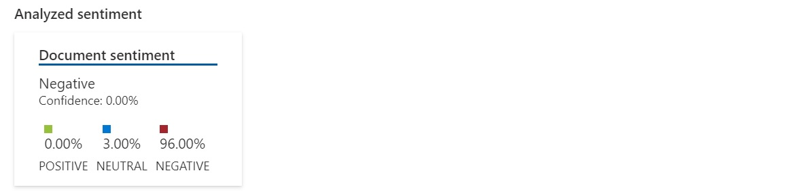
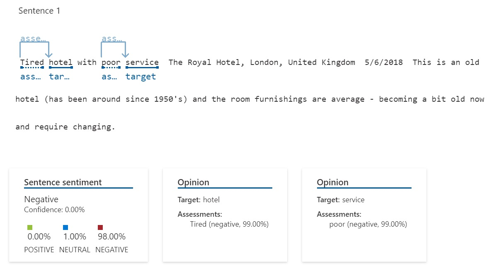
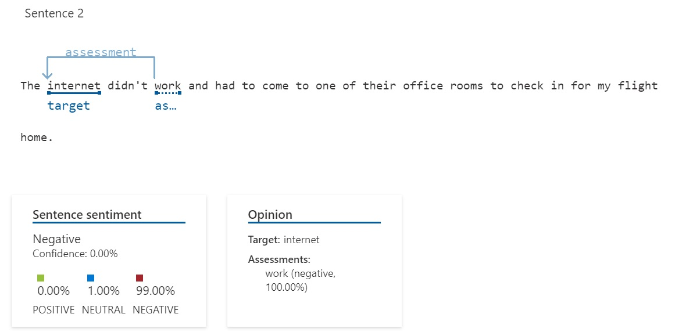
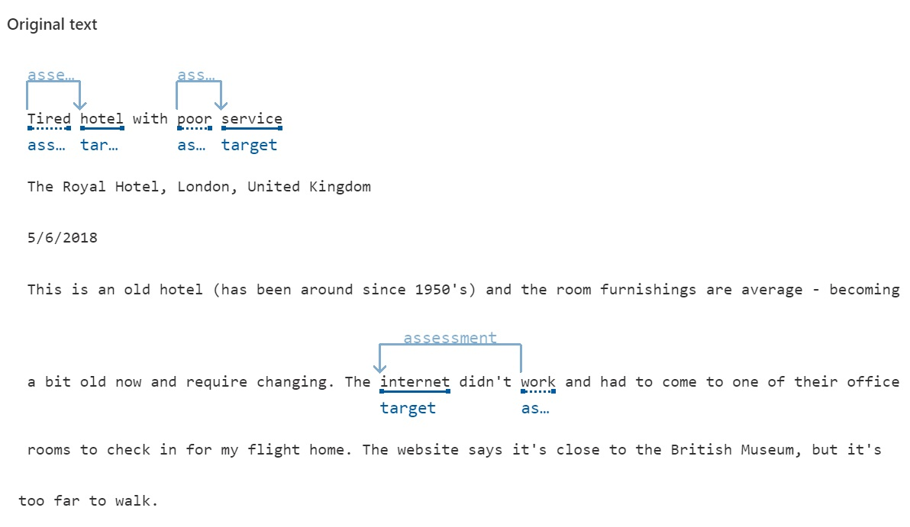

[\[English\]](README.md) [\[Português\]](#introdução)
_______________________________________________________________________________________________________________________________________
## Introdução

Testamos alguns dos serviços relacionados no [Azure Speech Studio](https://speech.microsoft.com/) e no [Azure Language Studio](https://language.cognitive.azure.com/). Foram utilizados alguns textos e áudios para gerar o resultado conforme as tabelas apresentadas em cada teste de funcionalidade.

## Fala para texto no Speech Studio

Usando o [Azure Speech Studio](https://speech.microsoft.com/), teste rapidamente seu áudio em um ponto de extremidade de reconhecimento de fala sem escrever nenhum código. O áudio será transformado em texto. Você pode escolher o idioma do áudio de entrada.

| Audio                                      | Resultado                                 | JSON                                    |
|---------------------------------------------|-----------------------------------------------|-----------------------------------------------|
| [Audio](Input/WhatAICanDo.m4a) | AI enables us to build amazing software that can improve healthcare, enable people to overcome physical disadvantages. Empower smart infrastructure, create incredible entertainment experiences, and even save the planet.<br><br> [File](Output/WhatAICanDo.txt) | [JSON](Output/WhatAICanDo.json) |

## Analise sentimentos e opiniões no Language Studio

Usando o [Azure Language Studio](https://language.cognitive.azure.com/) e o recurso Análise de Sentimento da API Text Analytics, que fornece rótulos de sentimento (como "negativo", "neutro" e "positivo") e suas pontuações de sentimento em cada frase e em relação a todo o documento. Você também pode enviar solicitações de Opinion Mining usando o endpoint Sentiment Analysis, que fornece informações granulares sobre as opiniões relacionadas às palavras (como atributos de produtos ou serviços) no texto.

Abaixo segue a análise do sentimento do seguinte texto:

```
 Tired hotel with poor service
 The Royal Hotel, London, United Kingdom
 5/6/2018
 This is an old hotel (has been around since 1950's) and the room furnishings are average - becoming a bit old now and require changing. The internet didn't work and had to 
 come to one of their office rooms to check in for my flight home. The website says it's close to the British Museum, but it's too far to walk.
```

| Texto                                      | Resultado                                 | JSON                                    |
|---------------------------------------------|-----------------------------------------------|-----------------------------------------------|
| [Text](Input/Opinion1.txt) | <br><br><br><br><br> | [JSON](Output/ResultOpinion1.json) |

A análise é feita individualmente em cada frase e em seguida é calculada a média das avaliações, que será o resultado final.

## Referências

[Explore Speech Studio](https://microsoftlearning.github.io/mslearn-ai-fundamentals/Instructions/Labs/09-speech.html)

[Analyze text with Language Studio](https://microsoftlearning.github.io/mslearn-ai-fundamentals/Instructions/Labs/06-text-analysis.html)
